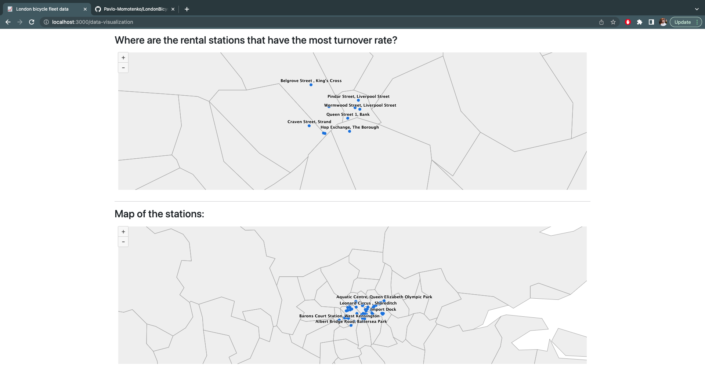

# London Bicycle Fleet Data

## Technology stack

1) Back-End part:
    - Python 3.10
    - Flask
    - SQLAlchemy
    - Pandas

2) Front-End part:
   - React
   - React Bootstrap
   - Highcharts

3) Database:
    - MySQL

## Installation
1) `docker-compose up -d`

## Screenshots

